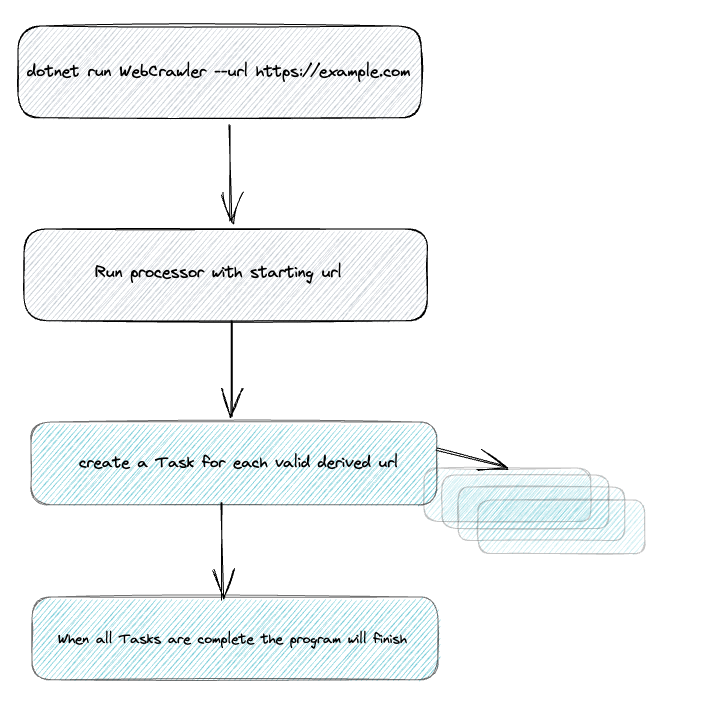

# Website Scraper Console App

## Overview

This is a simple web crawler written in C# which fits the following requirements:

* Given a starting URL, the crawler should visit each URL it finds on the same domain. It should print each URL visited, and a list of links found on that page.

* The crawler should be limited to one subdomain - so when you start with *<https://example.com/>*,  
but not follow external links, for example to facebook.com or community.example.com.

## How to run the application

### Prerequisites

[.Net Core SDK 6.0](https://dotnet.microsoft.com/en-us/download/dotnet/6.0)

### Running the application
This application can be built and run using the dotnet CLI with the default inplementation as shown below:

```
cd WebCrawler
dotnet run WebCrawler --url https://example.com/
```

it is possible to add an extra --max-depth variable however I have set the default to 4 to limit how many chained links are scraped.

```
dotnet run WebCrawler --url https://example.com/ --maxdepth 4
```
## Program structure


The program is given a starting URL which it will query ---> download the page and gather valid URLs on the page ---> adds the URL and its linked URLs to an in-memory cache --->
for each subsequent URL that meets the criteria to be queried the system will create a sub Task ---> there is a top-level Task that awaits all the child Tasks to be completed ---> the top-level Task is completed and the program ends.

## Further inprovements/Trade offs
* Add integration tests on the executable. It would be good to programatically launch the exe with various combinations of arguments and test the expected outputs.
* Better approach to error recording, along with appropriate tests.
* The ability to output responses as a csv/json.
* Results would be written back to a database.